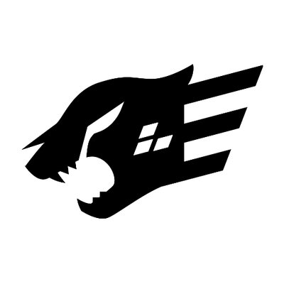

  
  

###

  

###

<h1 align="center">Next Level Week - Node.js 🚀️</h1>

###

<h3 align="left">👩‍💻  Back-end da aplicação desenvolvida durante o NLW Journey da Rocketseat</h3>

###

Este projeto foi desenvolvido durante as aulas do Next Level Week da <a href="https://www.rocketseat.com.br">Rocketseat</a>, escola online de programação que está levando as minhas habilidades em tecnologias web para outro nível.  - 🔭 O evento desenvolveu uma API para uma aplicação de planejamento de viagem; - 📚 A aplicação é desenvolvida em Node.js, com o framework Fastify e o Prisma ORM, utilizando o TypeScript como linguagem de programação (superset de JavaScript); - ⚡ Didática impecável do <a href="https://www.linkedin.com/in/diego-schell-fernandes/">Diego Fernandes</a>. - 💻️ A aplicação apresenta as rotas para a aplicação, com validação de dados usando a biblioteca Zod e tratamento de erros simples com as próprias instâncias do Fastify. - ⏭️ Futuramente irei implementar autenticação e autorização nas rotas, com o Front-End utilizando algum template para ser renderizado pela própria aplicação, funcionando como um monolito para pequenos e médios projetos.

###

<h3 align="left">🛠 Language and tools</h3>

###

  
  
  
  
  
  
  
  
  

###

<h3 align="left">🔥   My Stats :</h3>

###

  

###
